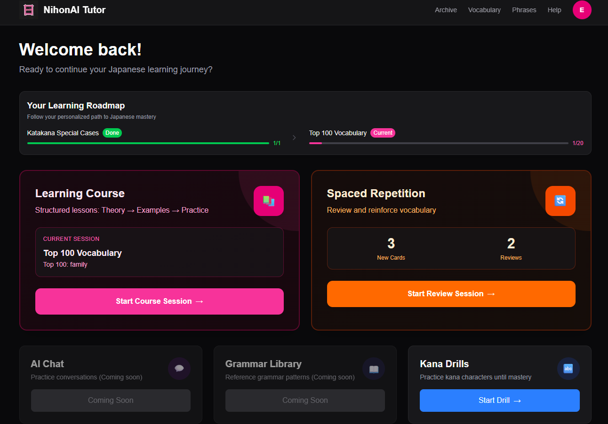
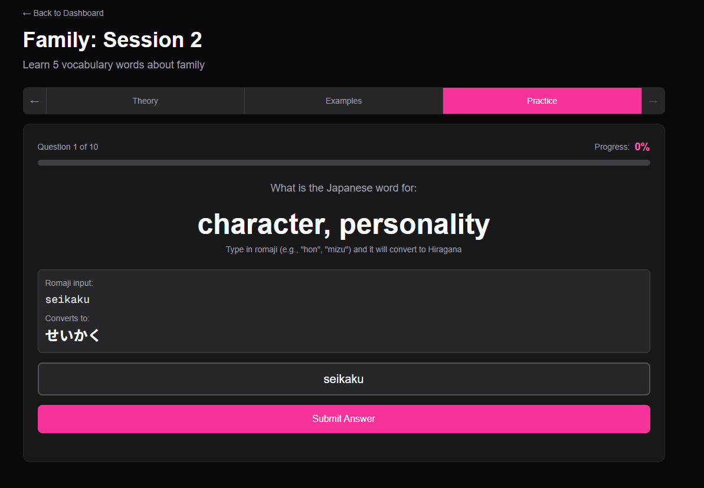
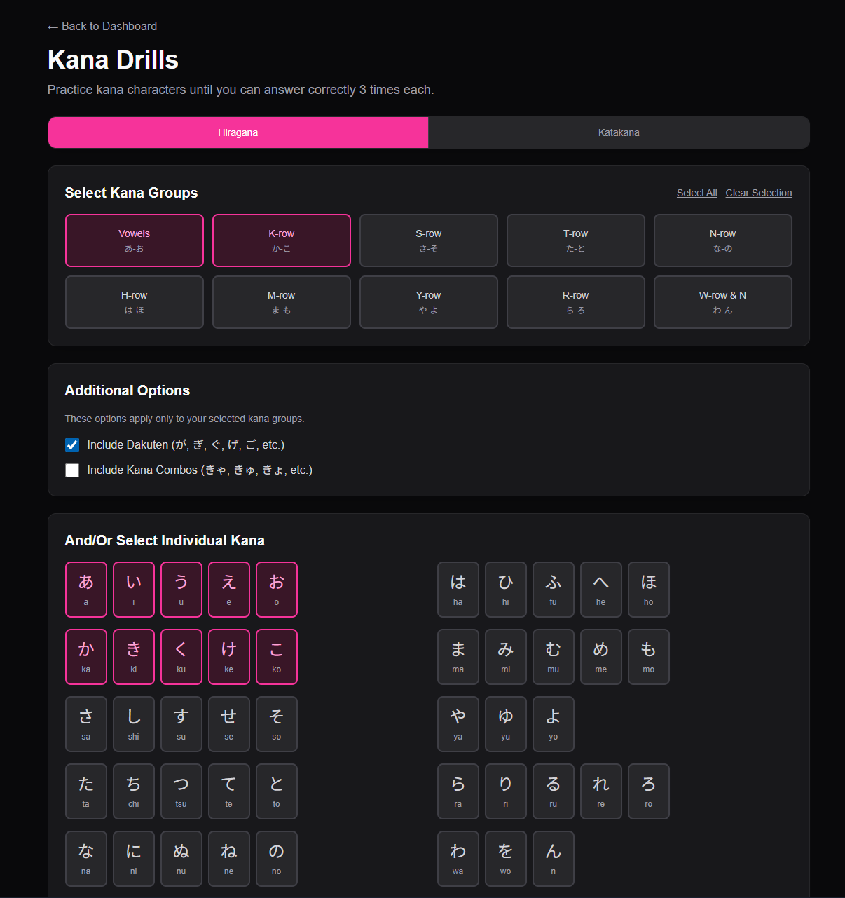
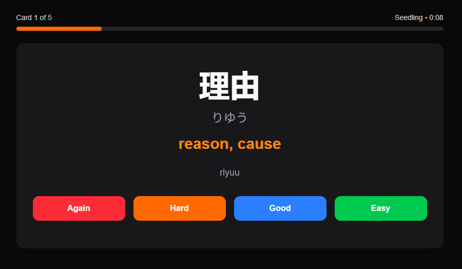
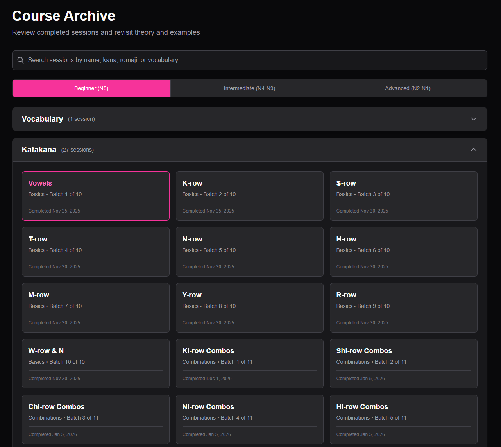

# NihonAI Tutor

An AI-powered Japanese language learning platform that provides structured lessons, interactive kana drills, and spaced repetition system (SRS) for vocabulary retention. The application helps learners master Japanese systematically through personalized learning paths, from basic hiragana and katakana to advanced vocabulary and grammar.

## Problem & Solution

Learning Japanese requires mastering multiple writing systems (hiragana, katakana, kanji) and thousands of vocabulary words. Traditional methods often lack structure, personalization, and efficient review systems. NihonAI Tutor solves this by providing a comprehensive learning platform with structured courses, interactive drills, and an SRS system that adapts to each learner's progress, ensuring efficient retention and systematic advancement through the language.

## Tech Stack

- **Frontend**: Next.js 16, React 19, TypeScript
- **Styling**: Tailwind CSS 4
- **Backend**: Supabase (PostgreSQL database, Authentication)
- **AI Integration**: OpenAI API (for student assistance, writing/speaking practice partners, and output session review)
- **Deployment**: Vercel
- **State Management**: React Hooks, Server Components
- **Routing**: Next.js App Router

## Key Features

- 📚 **Structured Learning Course** - Progressive lessons from hiragana basics to advanced vocabulary with theory, examples, and practice
- 🔤 **Kana Drills** - Interactive practice system for mastering hiragana and katakana characters with customizable drills
- 🔄 **Spaced Repetition System (SRS)** - Intelligent vocabulary review system that adapts to your learning pace
- 🗺️ **Learning Roadmap** - Visual progress tracker showing your journey through Japanese fundamentals
- 📊 **Progress Tracking** - Track completed batches, quiz scores, and learning milestones
- 🔐 **User Authentication** - Secure authentication with Supabase (Email/Google OAuth)
- 📱 **Responsive Design** - Mobile-friendly interface with dark mode support
- 🎯 **Adaptive Learning** - Personalized learning paths based on your progress and performance

## Screenshots / Demo

### Dashboard

*Main dashboard showing learning roadmap, current session, and quick access to all features*

### Learning Course Session

*Interactive learning session with theory, examples, and practice tabs*

### Kana Drills

*Customizable kana practice drills for mastering hiragana and katakana characters*

### Spaced Repetition System (SRS)

*Vocabulary review system with adaptive scheduling based on your performance*

### Course Archive

*Completed course archive showing all finished batches and progress history*

## What I Learned

- **Next.js App Router & Server Components**: Built a full-stack application using Next.js 16's App Router, leveraging Server Components for efficient data fetching and improved performance. Learned to structure complex applications with proper separation between client and server components.

- **Spaced Repetition Algorithm Implementation**: Implemented an SRS system with proper scheduling algorithms, understanding how to balance learning efficiency with user engagement. Gained experience in designing data structures for tracking learning progress and optimizing review schedules.

## Getting Started

### Prerequisites

- Node.js 18+ installed
- npm or yarn
- Supabase account (free tier works)
- OpenAI API key (optional, for AI chat assistance and practice features)

### Installation

1. Clone the repository:
```bash
git clone https://github.com/erwintrg/NihonAI-Japanese-E-Learning-Platform.git
cd NihonAI-Japanese-E-Learning-Platform
```

2. Install dependencies:
```bash
npm install
```

3. Set up Supabase:
   - Create a project at [supabase.com](https://app.supabase.com)
   - Go to Project Settings → API
   - Copy your Project URL and anon/public key

4. Set up environment variables:
   Create a `.env.local` file in the root directory:
```bash
NEXT_PUBLIC_SUPABASE_URL=your_supabase_project_url
NEXT_PUBLIC_SUPABASE_ANON_KEY=your_supabase_anon_key
OPENAI_API_KEY=your_openai_api_key  # Optional
```

5. Set up database schema:
   - Go to Supabase Dashboard → SQL Editor
   - Run the SQL from `supabase/schema.sql`
   - Then run `supabase/schema-updates.sql` to add onboarding and roadmap fields
   - Run `supabase/schema-batch-completion.sql` for batch completion tracking

6. Run the development server:
```bash
npm run dev
```

7. Open [http://localhost:3000](http://localhost:3000) in your browser.

## Project Structure

```
nihonai/
├── app/                    # Next.js app directory
│   ├── (auth)/            # Authentication routes
│   ├── (dashboard)/       # Dashboard routes
│   │   ├── course/        # Learning course pages
│   │   ├── kana-drills/   # Kana practice drills
│   │   ├── srs/           # Spaced repetition system
│   │   └── archive/       # Completed course archive
│   ├── api/               # API routes
│   └── components/        # Shared components
├── lib/                   # Utility functions
│   ├── kana.ts           # Kana character data and utilities
│   ├── srs.ts            # SRS algorithm implementation
│   └── supabase/         # Supabase client configuration
├── data/                  # Static data files
│   ├── kana/             # Kana character definitions
│   └── categories/       # Vocabulary categories
└── supabase/             # Database schema files
```

## Available Scripts

- `npm run dev` - Start the development server
- `npm run build` - Build for production
- `npm run start` - Start the production server
- `npm run lint` - Run ESLint

## Development Status

This project is currently in active development. The following features are implemented:

✅ **Completed:**
- User authentication and onboarding
- Structured learning course (Hiragana, Katakana, Vocabulary)
- Kana drills with customizable practice
- Spaced Repetition System (SRS) for vocabulary
- Learning roadmap and progress tracking
- Course archive and batch completion tracking

🚧 **In Development:**
- Advanced analytics dashboard
- AI-powered conversation practice
- Grammar library and reference
- Enhanced progress visualization

## License

This project is private and proprietary.

## Author

[Erwin Trg](https://github.com/erwintrg)

---

**Built with ❤️ for Japanese language learners**
